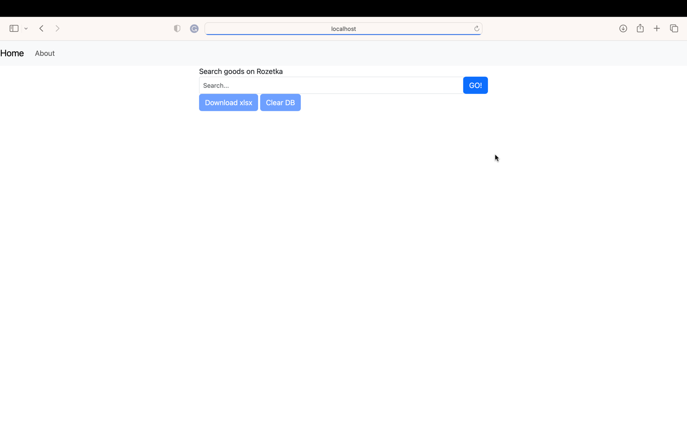
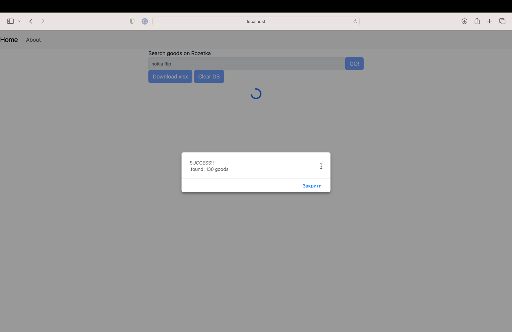
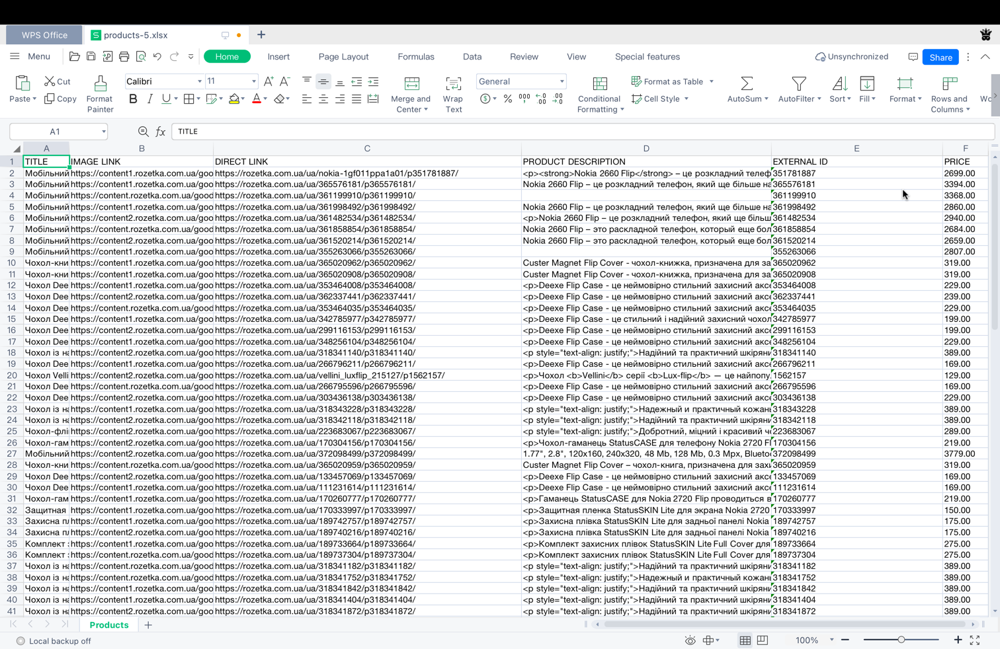

# Goods parser
### for java advanced course





## How to run
### Build by yourself
1) clone repository
2) setup DB properties in the application.properties file
```properties
spring.datasource.url=jdbc:postgresql://HOST_NAME:5432/DB_NAME
spring.datasource.username=USERNAME
spring.datasource.password=PASSWORD
```
3) run using mvnw 
```shell
./mvnw spring-boot:run
```
4) go to http://localhost:8080

PS: mvnw requires JAVA_HOME property in ENV

### Run using h2-db version
1) go to https://github.com/Noct2000/java-advanced/releases/tag/h2
2) download java-advanced-h2.jar
3) run 
```shell
java -jar java-advanced-h2.jar
```
4) go to http://localhost:8080

PS: it requires java 17
